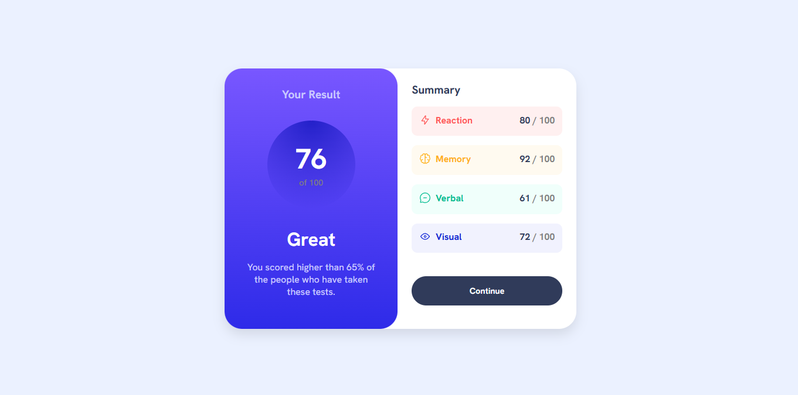
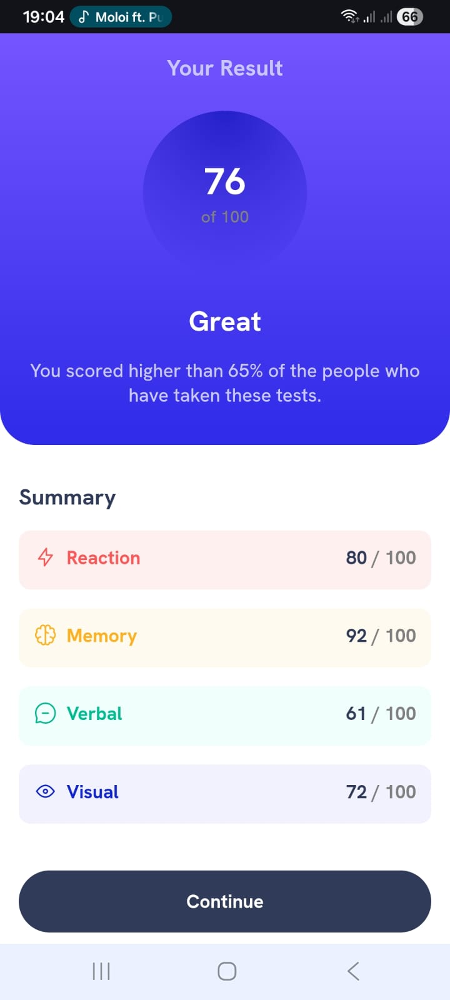

# Frontend Mentor - Results summary component solution

This is a solution to the [Results summary component challenge on Frontend Mentor](https://www.frontendmentor.io/challenges/results-summary-component-CE_K6s0maV). Frontend Mentor challenges help you improve your coding skills by building realistic projects. 

## Table of contents

- [Overview](#overview)
  - [The challenge](#the-challenge)
  - [Screenshot](#screenshot)
  - [Links](#links)
- [My process](#my-process)
  - [Built with](#built-with)
  - [What I learned](#what-i-learned)
  - [Continued development](#continued-development)
- [Author](#author)

## Overview

### The challenge

Users should be able to:

- View the optimal layout for the interface depending on their device's screen size
- See hover and focus states for all interactive elements on the page
- **Bonus**: Use the local JSON data to dynamically populate the content

### Screenshot

### Links

- Solution URL: (https://github.com/surprise2024-cpu/results-summary-component-main.git)
- Live Site URL: (https://surprise2024-cpu.github.io/results-summary-component-main/)

## My process

### Built with

- Semantic HTML5 markup
- CSS custom properties
- Flexbox
- Responsive design with media queries
- Javascript Fetch API
- Dynamic DOM manipulation

### What I learned

Fistly, fetching data using JavaScript Fetch API, that was interesting to figure out.

Secondly, working with external data e.g. data.json, it ws the first time during the bootcamp where we worked with an external data page like this so that was enjoyable to learn.

And thirdly, this project has helped me understand how HTML, CSS, JavaScript and JSON work together to create interesting web applications.

### Continued development

The media side of this project was a tricky issue, the fact that changing on component or adding another component could affect the entire project is/was truly frustrating to deal with, so thats something i want to work on.

## Author

- Website - [Suprise Nkosi](https://surprise2024-cpu.github.io/results-summary-component-main/)
